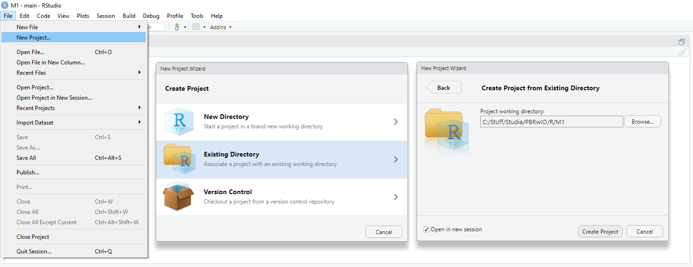
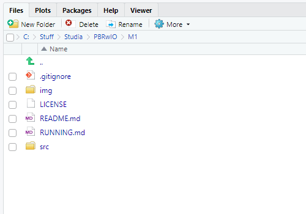
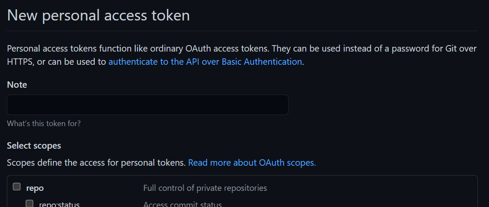
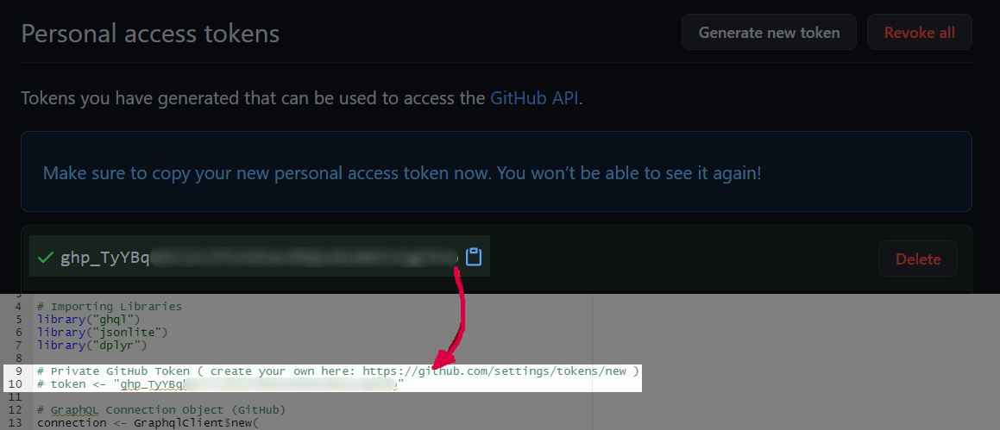
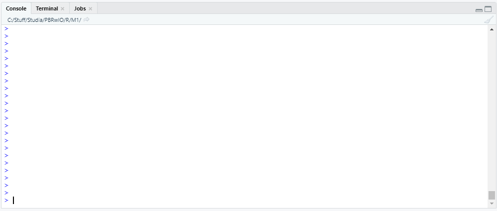
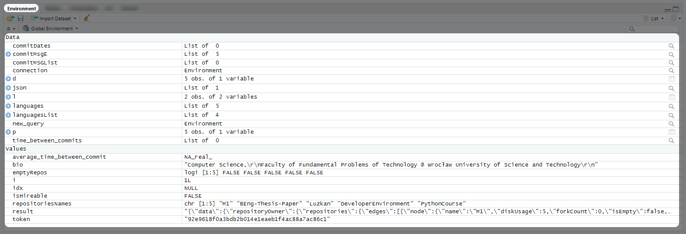
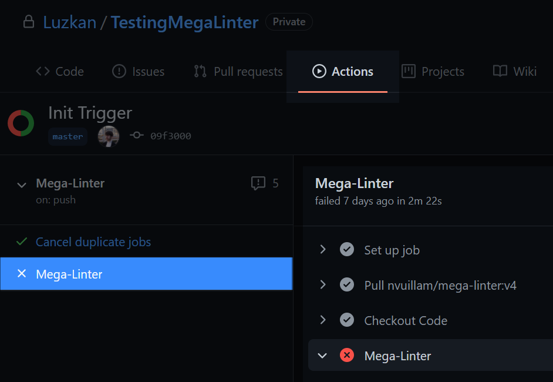
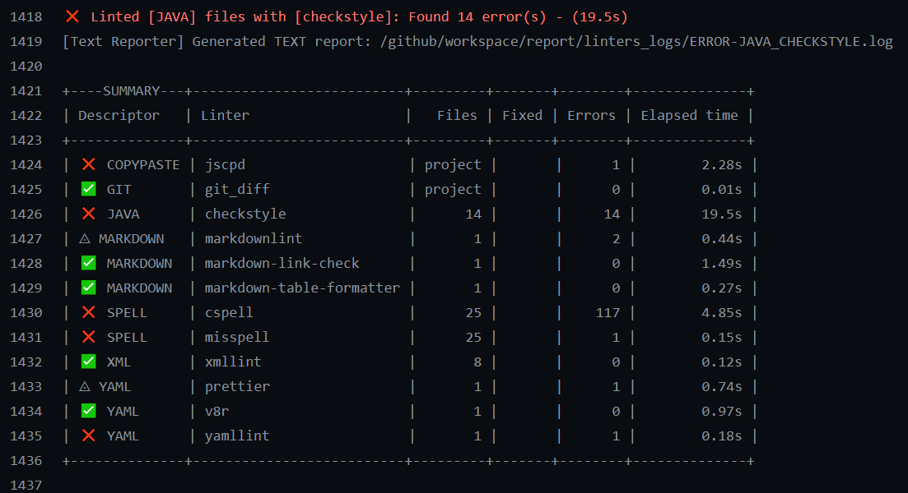

<h1 align="center">
  <br>
  Git Profiler <b>v0.8.0</b> <i>(PBR21M1)</i>
  <br>
</h1>

<h4 align="center">Automatic profiler based on GitHub Profile</h4>

<p align="center">
  <a href="#features">Features</a> •
  <a href="#usage">Usage</a> •
  <a href="#data">Data</a> •
  <a href="#planned">Paper</a>
</p>

## **Features**

- GitHub Graph QL Query which gives on output all the data that could be useful in this research.

## **Usage**

### Requirements:

- [R Studio](https://www.rstudio.com/) - Data Science tool with integrated development environment for R language.
- [R Language](https://www.r-project.org/) - programming language and free software environment for statistical computing and graphics
- [GHQL](https://github.com/ropensci/ghql) - a GraphQL client for R
- [MegaLinter](https://github.com/nvuillam/mega-linter) - all-in-one linter solution

<details>
  <summary>Running the R Scripts.</summary>

---

### Running:

Launching New Project.



Navigating to directory containing scripts (`./src/gitprofiler/r_scripts/`).



Open one of the scripts. You have to modify line `10`, which holds the **GitHub Token** value. You can generate one via [Personal Access Token Page](https://github.com/settings/tokens/new).



After generating one, replace the string `token <- "`**`<token>`**`"` in order to be able to access GitHub Graph QL.



Console Window when running the Query (`v0.1.0`).



**Results** can be found in the _Environment_ tab on the right pane.



</details>

<details>
  <summary>Running the Mega Linter.</summary>

---

### Current State

At this moment we are investigating incorporating **docker** into the project so we could make use of the **Mega Linter** locally. As of `v0.1.0` we tested it through [GitHub CI](https://docs.github.com/en/actions/guides/about-continuous-integration).

### Setup & Run

Choose any repository of yours and clone it to your machine using [`git clone`](https://git-scm.com/docs/git-clone) command. Then proceed:

```cmd
cd <your_project_name>
mkdir .github && cd .github
mkdir workflows && cd workflows
notepad mega-linter.yml
```

Then paste this code snippet below and save the file.

```yaml
name: Mega-Linter

on:
  push:
  pull_request:
    branches: [master, main]

jobs:
  cancel_duplicates:
    name: Cancel duplicate jobs
    runs-on: ubuntu-latest
    steps:
      - uses: fkirc/skip-duplicate-actions@master
        with:
          github_token: ${{ secrets.PAT || secrets.GITHUB_TOKEN }}

  build:
    name: Mega-Linter
    runs-on: ubuntu-latest
    steps:
      - name: Checkout Code
        uses: actions/checkout@v2
        with:
          token: ${{ secrets.PAT || secrets.GITHUB_TOKEN }}
          fetch-depth: 0
      - name: Mega-Linter
        id: ml
        uses: nvuillam/mega-linter@v4
        env:
          VALIDATE_ALL_CODEBASE: ${{ github.event_name == 'push' && github.ref == 'refs/heads/master' }}
          GITHUB_TOKEN: ${{ secrets.GITHUB_TOKEN }}
      - name: Archive production artifacts
        if: ${{ success() }} || ${{ failure() }}
        uses: actions/upload-artifact@v2
        with:
          name: Mega-Linter reports
          path: |
            report
            mega-linter.log
```

Lastly, push the new workflow into your Remote GitHub Repository with

```bash
git add .
git commit -m "MegaLinter"
git push -f
```

Now, you can open your project through a web browser and navigate to _"Actions"_ tab. You should see the Mega Linter job.



Here's an example result from Mega Linter.



</details>

<details>
  <summary>Running the Mega Linter locally.</summary>

---

## Requirements

**Important Notice:** Mega Linter is super-heavy in terms of required storage (**`40GB+`**).

As a prerequisite - you have to have [Docker](https://www.docker.com/products/docker-desktop) installed on your computer.

> Windows

First, download the [Linux Kernel Update Package](https://docs.microsoft.com/pl-pl/windows/wsl/install-win10#step-4---download-the-linux-kernel-update-package). It is necessary for Docker to work on your machine. Then, download the Docker [executable installer](https://www.docker.com/products/docker-desktop) and install it just like any other application. Restart is mandatory after the installation.

> Unix

Depending on the version of your distro, something analogous to this command should do the job:

```sh
sudo apt-get install docker-ce docker-ce-cli containerd.io
```

## Running

If you have Docker already installed:

- clone fresh copy of desired repository which you would like to examine using [`git clone`](https://git-scm.com/docs/git-clone) command.
- navigate to the repository
- run this command: `npx mega-linter-runner --flavor all -e 'ENABLE=,DOCKERFILE,MARKDOWN,YAML' -e 'SHOW_ELAPSED_TIME=true'`

New directory should be created in the repository called `reports`.

</details>

<details>
  <summary>Running Mega Linter Scrape Script.</summary>

---

## Requirements

As a prerequisite - you have to have [Python](https://www.python.org/downloads/) installed on your computer. The script has been written with [Python 3.9.4](https://www.python.org/downloads/release/python-394/).

## Running

Navigate to the [`/src/gitprofiler/py_scripts/`](./src/gitprofiler/py_scripts) directory. Add your output log file _(you can generate the output log by appending ` > output.txt` to the command which redirects the standard output stream into text file)_ into this directory and then open up console and type in:

```sh
python scrape.py -f output.txt
```

This will generate `output.json` file (in the same directory) which will contain logs in `json` format as list where under each index one can find dictionary:

```python
{
  "language": str,
  "linter": str,
  "files": int or str,  # amount of detected files in given language by linter
  "fixed": int,         # amount of fixed errors automatically by linter
  "errors": int         # amount of errors that could not be fixed by linter
},
```

or

```python
{
  "language": str,
  "files": int,                      # amount of detected files in given language by linter
  "lines": int,                      # amount of detected lines in a given language
  "tokens": int,                     # amount of detected tokens ("chars") in a given language
  "clones": int,
  "duplicate_lines_num": int,
  "duplicate_lines_percent": float,
  "duplicate_tokens_num": int,
  "duplicate_tokens_percent": float
},
```

</details>

## **Data**

All available data can be found in the [`./data`](./data/) directory. Most importantly: [`cleaned_data.csv`](./data/cleaned_data.csv) contains all the information that were used in the machine learning model. It is preformatted and adjusted - ready to use out of the box.

## **Paper**

TBD.
